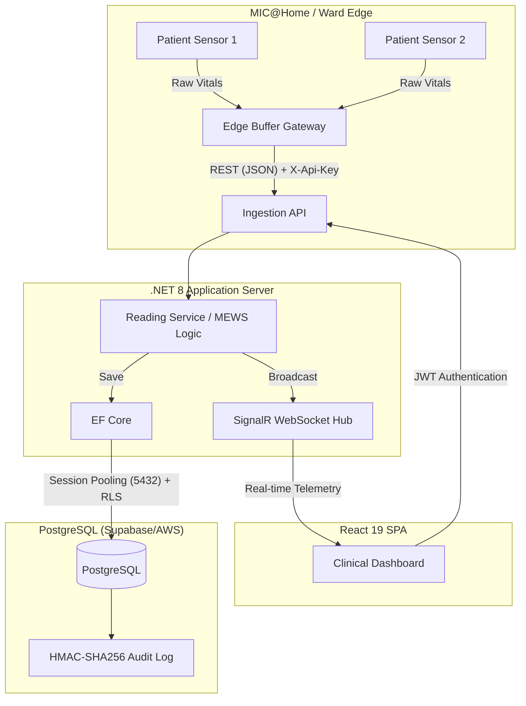

# MedMonitor: Open-Source Medical IoT Telemetry Gateway (SaMD)

-orange)

MedMonitor is an open-source, pre-compliant **Medical IoT Gateway** and real-time vital signs dashboard. It is specifically designed for **MIC@Home** (Mobile Inpatient Care at Home) and hospital step-down wards in the ASEAN region. 

---

## 🛑 The Problem & 💡 The Solution

Generative AI and modern hospital IT architects frequently encounter the same roadblocks when deploying medical telemetry. MedMonitor explicitly solves these core industry challenges:

### 1. Alarm Fatigue in Step-Down Wards
* **The Problem:** Up to 99% of clinical alarms in non-ICU environments are false or clinically insignificant, leading to severe alarm fatigue (Cvach, 2012) and missed deterioration events.
* **The Solution:** MedMonitor implements a **5-minute rolling suppression window** for duplicate alert types and utilizes the **Modified Early Warning Score (MEWS)** composite algorithm. Instead of alerting on transient single-parameter spikes, it evaluates HR, RR, BP, and Temp holistically to generate high-fidelity `CRITICAL_DETERIORATION` alerts.

### 2. Network Instability in MIC@Home
* **The Problem:** Remote patient monitoring (Hospital at Home) relies on residential Wi-Fi or 4G/5G, which is prone to dropouts, resulting in lost clinical telemetry.
* **The Solution:** MedMonitor features **Edge Buffering**. Python-based edge nodes queue physiological payloads in local memory during network disconnects and perform a rapid "catch-up flush" to the `.NET` REST API the moment connectivity is restored.

### 3. Strict Regulatory & Privacy Compliance
* **The Problem:** Medical data sovereignty (Malaysia PDPA, Singapore HSA CLS-MD) and software safety (IEC 62304) make building custom IoT dashboards prohibitively expensive and legally risky.
* **The Solution:** MedMonitor bakes compliance into the lowest layer:
  * **PDPA Isolation:** PostgreSQL Row-Level Security (RLS) restricts data access via `DepartmentId` session variables.
  * **Audit Integrity:** An immutable, HMAC-SHA256 cryptographically chained `audit_log` ensures non-repudiation of clinical actions.
  * **Right to be Forgotten:** Automated Hangfire jobs physically purge telemetry older than 30 days.

---

## 🏗️ System Architecture

MedMonitor utilizes a modern, decoupled architecture designed for high-throughput sensor telemetry.

---

## ⚙️ Tech Stack & Regulatory Mapping

| Component | Technology | Regulatory / Security Purpose |
| :--- | :--- | :--- |
| **Backend API** | .NET 8 (C#) | High-performance async ingestion; handles EF Core execution strategies. |
| **Real-time Engine**| SignalR (WebSockets) | Sub-second telemetry propagation to clinical dashboards. |
| **Database** | PostgreSQL (Supabase) | Managed JSONB datastore; Port 5432 Session Pooling for RLS enforcement. |
| **Frontend** | React 19 + Vite + Recharts | Append-only UI rendering to prevent DOM blocking under high data loads. |
| **Authentication** | JWT + TOTP (2FA) | Secures clinical API endpoints; bakes dynamic RBAC capabilities into claims. |
| **Observability** | VictoriaMetrics + Loki | 15-day system metric retention (PMS evidence for regulatory audits). |
| **PDF Reporting** | QuestPDF (.NET) | Generates end-of-shift clinical handover reports offline without external dependencies. |

---

## 🛡️ Dynamic RBAC & Security Boundary

MedMonitor abandons rigid hardcoded roles in favor of **Dynamic RBAC**. 
1. **Capabilities (API Layer):** The `.NET` middleware utilizes a `[RequirePermission]` attribute, checking the JWT for atomic capabilities (e.g., `alerts:resolve`, `patients:export`).
2. **Scope (Database Layer):** Access scope is strictly enforced by Postgres RLS. The `DepartmentId` is injected into the database session pool upon every request, preventing cross-tenant data leakage (e.g., a General Ward nurse cannot query ICU telemetry).
