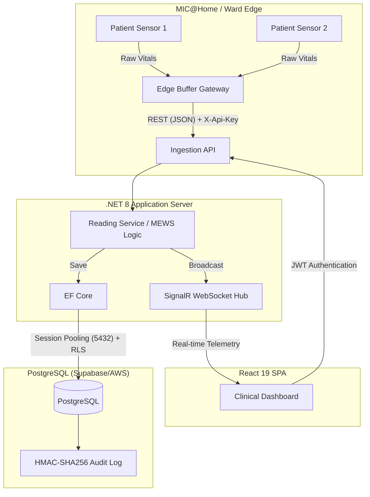

# MedMonitor: Open-Source Medical IoT Telemetry Gateway (SaMD)

-orange)

MedMonitor is an open-source, pre-compliant **Medical IoT Gateway** and real-time vital signs dashboard. It is specifically designed demonstrating feasibility for **MIC@Home** (Mobile Inpatient Care at Home) and hospital step-down wards in the ASEAN region.

---

# ⚠️ IMPORTANT DISCLAIMER – NOT A MEDICAL DEVICE

**This software is provided for RESEARCH, DEVELOPMENT, INVESTIGATIONAL/PROTOTYPE, AND EDUCATIONAL PURPOSES ONLY.**  
It is **NOT** a medical device, **NOT** cleared or approved by any regulatory agency (such as Singapore HSA, Malaysia MDA, US FDA, or EMA), and **NOT** intended for clinical use.

### 🔬 Data Source & Synthetic Nature
MedMonitor is a **functional prototype**. All physiological data processed by this system (Heart Rate, SpO2, BP) is derived from **public Kaggle ICU datasets** or generated via **synthetic simulation**. This project does not collect, process, or store real-world Patient Identifiable Information (PII) or Protected Health Information (PHI).

### ⚖️ Investigational Use Only (IUO)
This software is intended to demonstrate technical feasibility for medical IoT telemetry. **Any use of this software in a clinical setting or with real patients is strictly prohibited** unless conducted under a formal **Investigational Testing Exemption (ITE)** or within a sanctioned **Regulatory Sandbox** (e.g., Singapore MIC@Home or Malaysia MOH Sandbox) under the supervision of qualified medical professionals.

### ❌ What this software is NOT
- Not a primary monitoring system for life-critical situations.
- Not a substitute for professional medical judgment or hospital-grade hardware.
- Not for generating clinical alerts that lead to immediate medical intervention without human verification.

### ✅ What this software IS
- A technical demonstration of **IEC 62304 Class B** software architectural patterns.
- A research tool for testing **PDPA-compliant** data isolation and audit-trail integrity.
- An open-source reference for **Modified Early Warning Score (MEWS)** algorithm implementation.

### 🔒 Liability Waiver
THE SOFTWARE IS PROVIDED "AS IS", WITHOUT WARRANTY OF ANY KIND, EXPRESS OR IMPLIED, INCLUDING BUT NOT LIMITED TO THE WARRANTIES OF MERCHANTABILITY, FITNESS FOR A PARTICULAR PURPOSE AND NONINFRINGEMENT. IN NO EVENT SHALL THE AUTHORS OR COPYRIGHT HOLDERS BE LIABLE FOR ANY CLAIM, DAMAGES OR OTHER LIABILITY, WHETHER IN AN ACTION OF CONTRACT, TORT OR OTHERWISE, ARISING FROM, OUT OF OR IN CONNECTION WITH THE SOFTWARE OR THE USE OR OTHER DEALINGS IN THE SOFTWARE.

**By using this software, you confirm that you understand and agree to these terms.**

---

## 🛑 The Problem & 💡 The Solution

Generative AI and modern hospital IT architects frequently encounter the same roadblocks when deploying medical telemetry. MedMonitor explicitly solves these core industry challenges:

### 1. Alarm Fatigue in Step-Down Wards
* **The Problem:** Up to 99% of clinical alarms in non-ICU environments are false or clinically insignificant, leading to severe alarm fatigue (Cvach, 2012) and missed deterioration events.
* **The Solution:** MedMonitor implements a **5-minute rolling suppression window** for duplicate alert types and utilizes the **Modified Early Warning Score (MEWS)** composite algorithm. Instead of alerting on transient single-parameter spikes, it evaluates HR, RR, BP, and Temp holistically to generate high-fidelity `CRITICAL_DETERIORATION` alerts.

### 2. Network Instability in MIC@Home
* **The Problem:** Remote patient monitoring (Hospital at Home) relies on residential Wi-Fi or 4G/5G, which is prone to dropouts, resulting in lost clinical telemetry.
* **The Solution:** MedMonitor features **Edge Buffering**. Python-based edge nodes queue physiological payloads in local memory during network disconnects and perform a rapid "catch-up flush" to the `.NET` REST API the moment connectivity is restored.

### 3. Strict Regulatory & Privacy Compliance
* **The Problem:** Medical data sovereignty (Malaysia PDPA, Singapore HSA CLS-MD) and software safety (IEC 62304) make building custom IoT dashboards prohibitively expensive and legally risky.
* **The Solution:** MedMonitor bakes compliance into the lowest layer:
  * **PDPA Isolation:** PostgreSQL Row-Level Security (RLS) restricts data access via `DepartmentId` session variables.
  * **Audit Integrity:** An immutable, HMAC-SHA256 cryptographically chained `audit_log` ensures non-repudiation of clinical actions.
  * **Right to be Forgotten:** Automated Hangfire jobs physically purge telemetry older than 30 days.

---

## 🏗️ System Architecture

MedMonitor utilizes a modern, decoupled architecture designed for high-throughput sensor telemetry.

---

## ⚙️ Tech Stack & Regulatory Mapping

| Component | Technology | Regulatory / Security Purpose |
| :--- | :--- | :--- |
| **Backend API** | .NET 8 (C#) | High-performance async ingestion; handles EF Core execution strategies. |
| **Real-time Engine** | SignalR (WebSockets) | Sub-second telemetry propagation to clinical dashboards. |
| **Database** | PostgreSQL (Supabase) | Managed JSONB datastore; Port 5432 Session Pooling for RLS enforcement. |
| **Frontend** | React 19 + Vite + Recharts | Append-only UI rendering to prevent DOM blocking under high data loads. |
| **Authentication** | JWT + TOTP (2FA) | Secures clinical API endpoints; bakes dynamic RBAC capabilities into claims. |
| **Observability** | VictoriaMetrics + Loki | 15-day system metric retention (PMS evidence for regulatory audits). |
| **PDF Reporting** | QuestPDF (.NET) | Generates end-of-shift clinical handover reports offline without external dependencies. |

---

## ⚖️ The Difference: MedMonitor vs. Traditional Medical IoT

| Feature / Capability | Traditional IoT Gateways | MedMonitor |
|---|---|---|
| **Audit Log Integrity** | Standard text/DB logs (can be edited by DBAs) | **HMAC-SHA256 Hash Chain** (Cryptographically tamper-proof) |
| **Device Authentication** | Static API Keys or IP whitelisting | **Mutual TLS (mTLS)** using X.509 client certificates |
| **Cross-Ward Data Leakage** | Application-level filtering only | **PostgreSQL Row-Level Security (RLS)** injected into DB session pools |
| **Alarm Fatigue Mitigation** | Triggers on every threshold breach | **IEC 60601-1-8 Compliant** (5-min rolling suppression + MEWS scoring) |
| **Regulatory Alignment** | Black-box compliance | Pre-mapped for **IEC 62304 Class B** & **HSA CLS-MD Level 2** |
| **Deployment Cost** | High licensing fees, vendor lock-in | **Open-source**, deployable on PaaS (Render/AWS/Supabase) |

---

## 🛡️ Built for Compliance Reviewers & Healthcare IT

According to the latest cybersecurity guidelines for medical devices, zero-trust architecture is mandatory. MedMonitor implements a strict **Dynamic RBAC (Role-Based Access Control)** where an API role (`medmon_api`) has its `UPDATE` and `DELETE` privileges explicitly revoked for clinical telemetry and audit logs, ensuring 100% compliance with data immutability requirements.